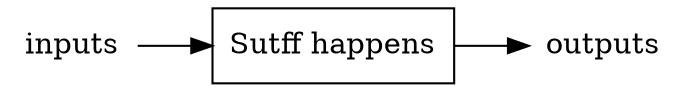

# BlackBlox
Simple simulator for multi-chain black box process models.

# Current Features
* Perform mass balance on a single unit process based on a specified output (or input) and a set of specified calculations
  - Ratio calculaitons (known Qty * known ratio)
  - Remainder calculations (known Qty * (1-known ratio)
  - Molecular Mass Ratio calculations (known Qty * (mol mass of unknown / mol mass of known)
  - Combustion calculations (mass of fuel use, and emissions of CO2 and waste heat, based on specified fuel type, energy demand, and efficieincy)
 * Calculate chains of unit processes based on a single final output or input
 * Calculate multiple scenarios of chains based on different variable sets 

 # How to Use

 ## Unit Processes

Each **unit process** is a single "black box" processes with inputs and outputs, with defined relationships to each other.

 ## Process Chains

 ## Running Scenarios

# Proposed Features
* Calculate multiple chains in one system
* Make each unit process direction reversible
* Add support for recycling flows
* BlackBlox Fade: Run the system over time and accumulate the results
  - Collect specified indicators into accumulators and timestep data
  - Specify start and end system variables with linear transition between them
  - Make pretty comparison graphs
* BlackBlox Gold: Add support for techoeconomic assessment
* BlackBlox Green: Add support for life cycle assessment
* BlackBlox Shimmer: Add support for sensitivity anaylsis and uncertainty assessment
